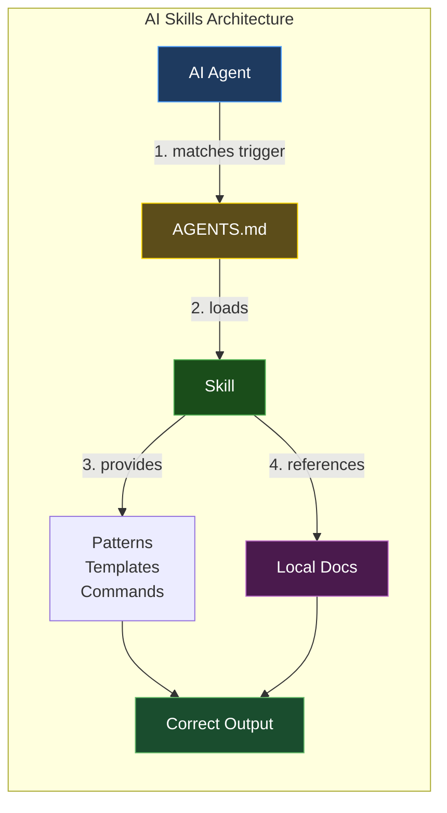
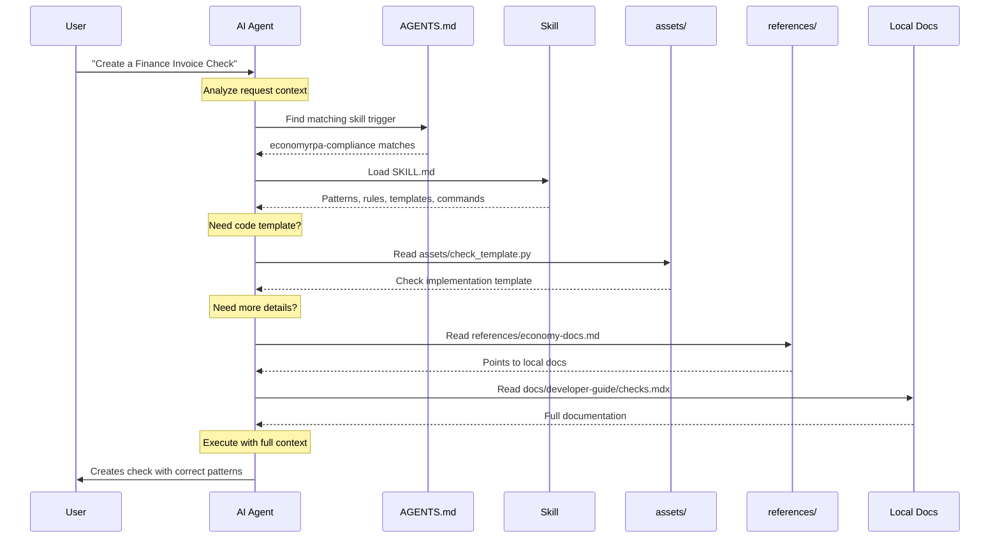
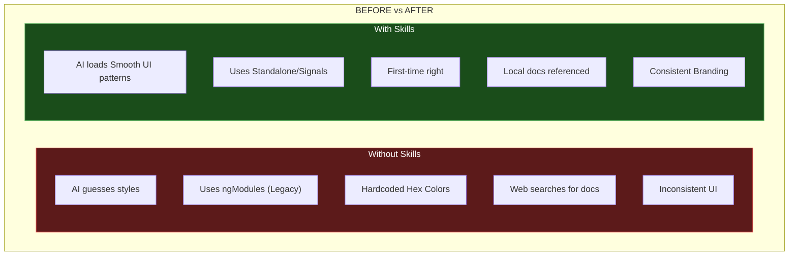
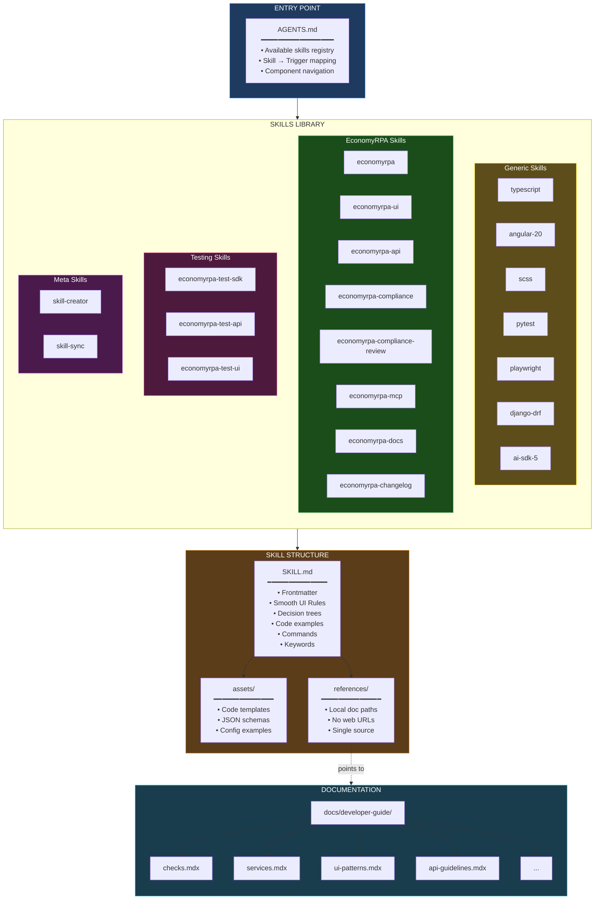

This guide explains the AI Skills system that provides on-demand context, "Smooth UI" patterns, and architectural rules to AI agents working with the EconomyRPA codebase.

<Info>
**What are AI Skills?** Skills are structured instructions that help AI agents (Claude Code, Cursor, Copilot, etc.) understand EconomyRPA's conventions, Angular 20 Signals implementation, Django DRF patterns, and best practices.
</Info>

## Architecture Overview




## How It Works



## Before vs After



## Complete Architecture



## Skills Included

| Type | Skills |
| --- | --- |
| **Generic** | typescript, angular-20, scss, pytest, playwright, django-drf, ai-sdk-5 |
| **EconomyRPA** | economyrpa, economyrpa-ui, economyrpa-api, economyrpa-mcp, economyrpa-compliance, economyrpa-compliance-review, economyrpa-docs, economyrpa-changelog |
| **Testing** | economyrpa-test-sdk, economyrpa-test-api, economyrpa-test-ui |
| **Meta** | skill-creator, skill-sync |

## Skill Structure

Each skill follows the [Agent Skills spec](https://agentskills.io) tailored for EconomyRPA:

```
skills/{skill-name}/
├── SKILL.md          # Patterns, UI rules, decision trees
├── assets/           # Code templates (e.g., Angular components, Django Views)
└── references/       # Links to local docs (single source of truth)

```

## Key Design Decisions

1. **Self-contained skills** - Critical "Smooth UI" patterns inline for fast loading.
2. **Local doc references** - Points directly to `docs/developer-guide/*.mdx`.
3. **Single source of truth** - Skills reference docs, ensuring alignment with the Brand Voice.
4. **On-demand loading** - AI loads only what's needed (e.g., loads `scss` only when styling).

## Creating New Skills

Use the `skill-creator` meta-skill to create new skills that follow the EconomyRPA Agent Skills spec. See `AGENTS.md` for the full list of available skills and their triggers.

